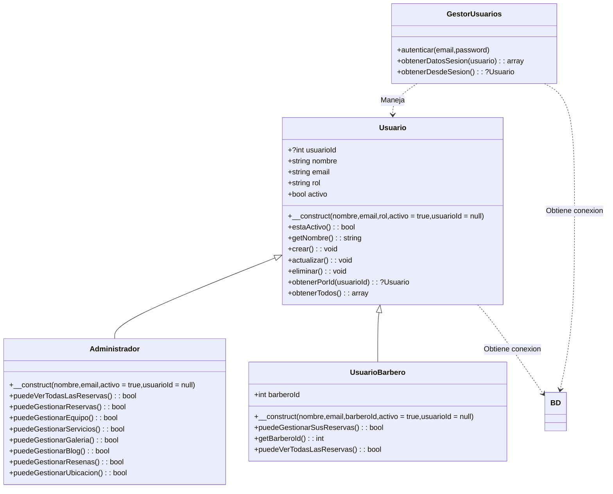

# Diagrama de Clases (Autogenerado)

```mermaid
classDiagram
    class Administrador {
        +__construct(nombre,email,activo = true,usuarioId = null)
        +puedeVerTodasLasReservas() : bool
        +puedeGestionarReservas() : bool
        +puedeGestionarEquipo() : bool
        +puedeGestionarServicios() : bool
        +puedeGestionarGaleria() : bool
        +puedeGestionarBlog() : bool
        +puedeGestionarResenas() : bool
        +puedeGestionarUbicacion() : bool
    }

    class GestorUsuarios {
        +autenticar(email,password)
        +obtenerDatosSesion(usuario) : array
        +obtenerDesdeSesion() : ?Usuario
    }

    class Usuario {
        +?int usuarioId
        +string nombre
        +string email
        +string rol
        +bool activo
        +__construct(nombre,email,rol,activo = true,usuarioId = null)
        +estaActivo() : bool
        +getNombre() : string
        +crear() : void
        +actualizar() : void
        +eliminar() : void
        +obtenerPorId(usuarioId) : ?Usuario
        +obtenerTodos() : array
    }

    class UsuarioBarbero {
        +int barberoId
        +__construct(nombre,email,barberoId,activo = true,usuarioId = null)
        +puedeGestionarSusReservas() : bool
        +getBarberoId() : int
        +puedeVerTodasLasReservas() : bool
    }

    Usuario <|-- Administrador
    Usuario <|-- UsuarioBarbero
    GestorUsuarios ..> Usuario : Maneja
    GestorUsuarios ..> BD : Obtiene conexion
    Usuario ..> BD : Obtiene conexion
```