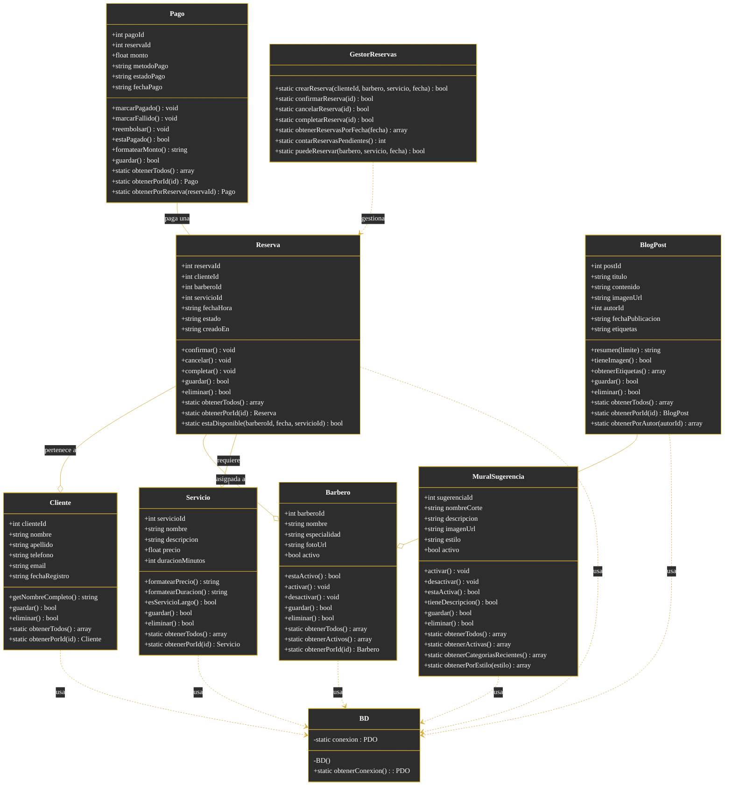

```mermaid
%%{init: {
  'theme': 'base',
  'themeVariables': {
    'primaryColor': '#1a1a1a',
    'primaryTextColor': '#fff',
    'primaryBorderColor': '#d4af37',
    'lineColor': '#d4af37',
    'secondaryColor': '#2d2d2d',
    'tertiaryColor': '#f4f4f4',
    'mainBkg': '#2d2d2d',
    'nodeBorder': '#d4af37',
    'clusterBkg': '#2d2d2d',
    'titleColor': '#d4af37',
    'fontFamily': 'trebuchet ms'
  }
} }%%

classDiagram
    class BD {
        -static conexion : PDO
        -BD()
        +static obtenerConexion() : PDO
    }

    class Barbero {
        +int barberoId
        +string nombre
        +string especialidad
        +string fotoUrl
        +bool activo
        +estaActivo() bool
        +activar() void
        +desactivar() void
        +guardar() bool
        +eliminar() bool
        +static obtenerTodos() array
        +static obtenerActivos() array
        +static obtenerPorId(id) Barbero
    }

    class Cliente {
        +int clienteId
        +string nombre
        +string apellido
        +string telefono
        +string email
        +string fechaRegistro
        +getNombreCompleto() string
        +guardar() bool
        +eliminar() bool
        +static obtenerTodos() array
        +static obtenerPorId(id) Cliente
    }

    class Servicio {
        +int servicioId
        +string nombre
        +string descripcion
        +float precio
        +int duracionMinutos
        +formatearPrecio() string
        +formatearDuracion() string
        +esServicioLargo() bool
        +guardar() bool
        +eliminar() bool
        +static obtenerTodos() array
        +static obtenerPorId(id) Servicio
    }

    class Reserva {
        +int reservaId
        +int clienteId
        +int barberoId
        +int servicioId
        +string fechaHora
        +string estado
        +string creadoEn
        +confirmar() void
        +cancelar() void
        +completar() void
        +guardar() bool
        +eliminar() bool
        +static obtenerTodos() array
        +static obtenerPorId(id) Reserva
        +static estaDisponible(barberoId, fecha, servicioId) bool
    }

    class Pago {
        +int pagoId
        +int reservaId
        +float monto
        +string metodoPago
        +string estadoPago
        +string fechaPago
        +marcarPagado() void
        +marcarFallido() void
        +reembolsar() void
        +estaPagado() bool
        +formatearMonto() string
        +guardar() bool
        +static obtenerTodos() array
        +static obtenerPorId(id) Pago
        +static obtenerPorReserva(reservaId) Pago
    }

    class MuralSugerencia {
        +int sugerenciaId
        +string nombreCorte
        +string descripcion
        +string imagenUrl
        +string estilo
        +bool activo
        +activar() void
        +desactivar() void
        +estaActiva() bool
        +tieneDescripcion() bool
        +guardar() bool
        +eliminar() bool
        +static obtenerTodos() array
        +static obtenerActivas() array
        +static obtenerCategoriasRecientes() array
        +static obtenerPorEstilo(estilo) array
    }

    class BlogPost {
        +int postId
        +string titulo
        +string contenido
        +string imagenUrl
        +int autorId
        +string fechaPublicacion
        +string etiquetas
        +resumen(limite) string
        +tieneImagen() bool
        +obtenerEtiquetas() array
        +guardar() bool
        +eliminar() bool
        +static obtenerTodos() array
        +static obtenerPorId(id) BlogPost
        +static obtenerPorAutor(autorId) array
    }

    class GestorReservas {
        +static crearReserva(clienteId, barbero, servicio, fecha) bool
        +static confirmarReserva(id) bool
        +static cancelarReserva(id) bool
        +static completarReserva(id) bool
        +static obtenerReservasPorFecha(fecha) array
        +static contarReservasPendientes() int
        +static puedeReservar(barbero, servicio, fecha) bool
    }

    %% Relaciones 
    Reserva "*" --o "1" Cliente : pertenece a
    Reserva "*" --o "1" Barbero : asignada a
    Reserva "*" --o "1" Servicio : requiere
    Pago "1" -- "1" Reserva : paga una
    BlogPost "*" --o "1" Barbero : escrito por (autorId)
    GestorReservas ..> Reserva : gestiona
    
    %% Dependencia común a la Base de Datos
    Barbero ..> BD : usa
    Cliente ..> BD : usa
    Reserva ..> BD : usa
    Servicio ..> BD : usa
    MuralSugerencia ..> BD : usa
    BlogPost ..> BD : usa
```