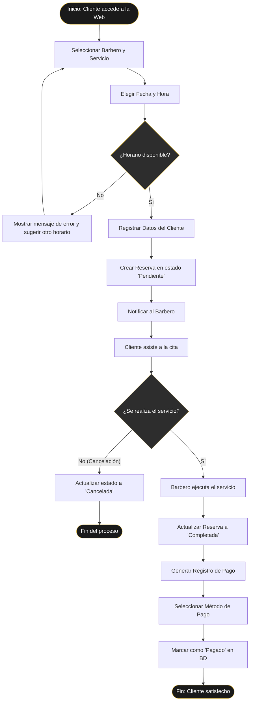
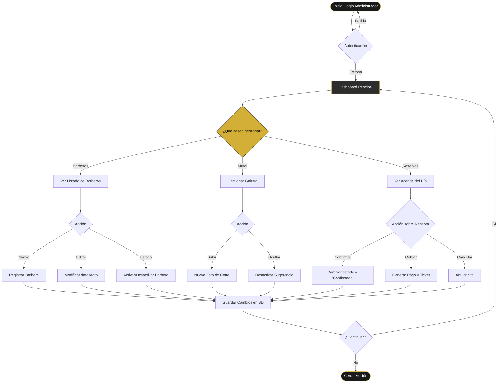

```mermaid
graph TD
    %% Inicio del proceso
    A([Inicio: Cliente accede a la Web]) --> B[Seleccionar Barbero y Servicio]
    B --> C[Elegir Fecha y Hora]
    
    %% Validación de disponibilidad
    C --> D{¿Horario disponible?}
    
    D -- No --> E[Mostrar mensaje de error y sugerir otro horario]
    E --> B
    
    D -- Sí --> F[Registrar Datos del Cliente]
    F --> G[Crear Reserva en estado 'Pendiente']
    G --> H[Notificar al Barbero]
    
    %% Día de la cita
    H --> I[Cliente asiste a la cita]
    
    I --> J{¿Se realiza el servicio?}
    
    J -- No (Cancelación) --> K[Actualizar estado a 'Cancelada']
    K --> L([Fin del proceso])
    
    J -- Sí --> M[Barbero ejecuta el servicio]
    M --> N[Actualizar Reserva a 'Completada']
    
    %% Proceso de Pago
    N --> O[Generar Registro de Pago]
    O --> P[Seleccionar Método de Pago]
    P --> Q[Marcar como 'Pagado' en BD]
    
    Q --> R([Fin: Cliente satisfecho])

    %% Estilos para que se vea Pro
    style A fill:#1a1a1a,stroke:#d4af37,color:#fff
    style R fill:#1a1a1a,stroke:#d4af37,color:#fff
    style L fill:#1a1a1a,stroke:#d4af37,color:#fff
    style D fill:#2d2d2d,stroke:#d4af37,color:#fff
    style J fill:#2d2d2d,stroke:#d4af37,color:#fff
```

```mermaid
graph TD
    A([Inicio: Login Administrador]) --> B{Autenticación}
    B -- Fallida --> A
    B -- Exitosa --> C[Dashboard Principal]

    %% Ramas de gestión
    C --> D{¿Qué desea gestionar?}

    %% Rama de Barberos
    D --> |Barberos| E[Ver Listado de Barberos]
    E --> F{Acción}
    F --> |Nuevo| G[Registrar Barbero]
    F --> |Editar| H[Modificar datos/foto]
    F --> |Estado| I[Activar/Desactivar Barbero]
    G & H & I --> J[Guardar Cambios en BD]

    %% Rama de Mural
    D --> |Mural| K[Gestionar Galería]
    K --> L{Acción}
    L --> |Subir| M[Nueva Foto de Corte]
    L --> |Ocultar| N[Desactivar Sugerencia]
    M & N --> J

    %% Rama de Reservas
    D --> |Reservas| O[Ver Agenda del Día]
    O --> P{Acción sobre Reserva}
    P --> |Confirmar| Q[Cambiar estado a 'Confirmada']
    P --> |Cobrar| R[Generar Pago y Ticket]
    P --> |Cancelar| S[Anular cita]
    Q & R & S --> J

    J --> T{¿Continuar?}
    T -- Sí --> C
    T -- No --> U([Cerrar Sesión])

    %% Estilos "Barbería Catracha"
    style A fill:#1a1a1a,stroke:#d4af37,color:#fff
    style U fill:#1a1a1a,stroke:#d4af37,color:#fff
    style C fill:#2d2d2d,stroke:#d4af37,color:#fff
    style D fill:#d4af37,stroke:#000,color:#000
```