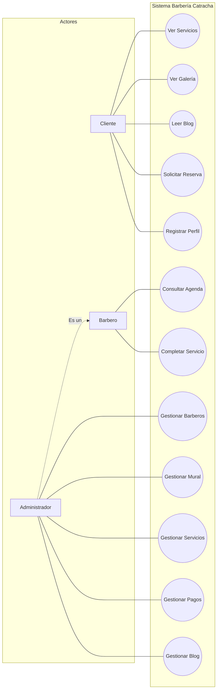

```mermaid
graph LR
    %% Definición de Actores con estilos
    subgraph Actores
        C[Cliente]
        B[Barbero]
        A[Administrador]
    end

    %% Definición del Sistema
    subgraph "Sistema Barbería Catracha"
        %% Casos de Uso del Cliente
        UC1((Ver Servicios))
        UC2((Ver Galería))
        UC3((Leer Blog))
        UC4((Solicitar Reserva))
        UC5((Registrar Perfil))

        %% Casos de Uso del Barbero
        UC6((Consultar Agenda))
        UC7((Completar Servicio))

        %% Casos de Uso del Administrador
        UC8((Gestionar Barberos))
        UC9((Gestionar Mural))
        UC10((Gestionar Servicios))
        UC11((Gestionar Pagos))
        UC12((Gestionar Blog))
    end

    %% Relaciones del Cliente
    C --- UC1
    C --- UC2
    C --- UC3
    C --- UC4
    C --- UC5

    %% Relaciones del Barbero
    B --- UC6
    B --- UC7

    %% Relaciones del Administrador
    A --- UC8
    A --- UC9
    A --- UC10
    A --- UC11
    A --- UC12
    
    %% Relación de herencia corregida para Flowchart
    A -.->|Es un| B
```