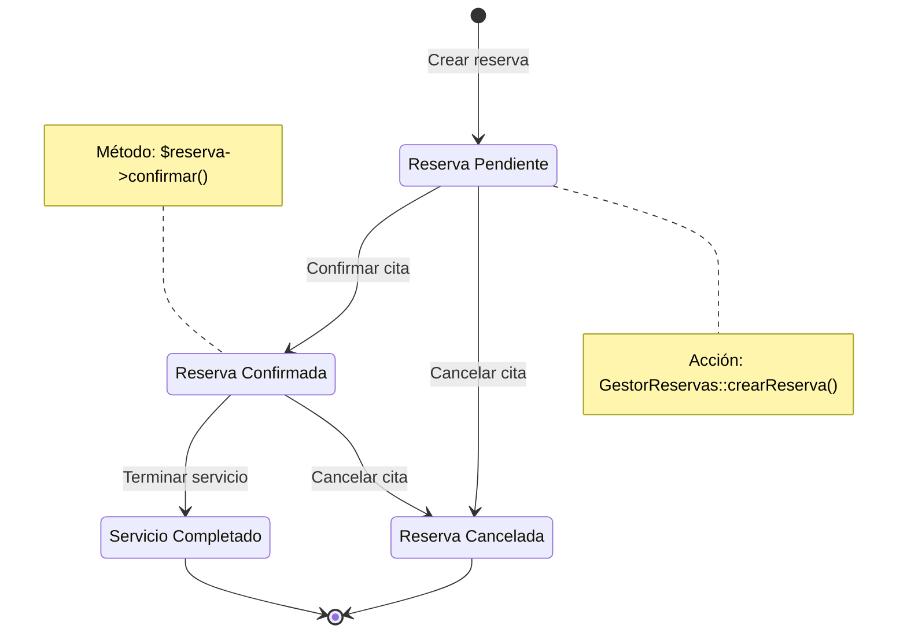
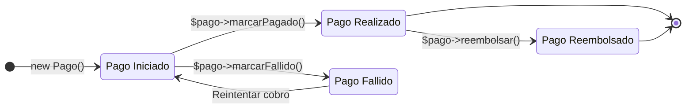

```mermaid
stateDiagram-v2
    direction TB

    state "Reserva Pendiente" as pendiente
    state "Reserva Confirmada" as confirmada
    state "Servicio Completado" as completada
    state "Reserva Cancelada" as cancelada

    [*] --> pendiente : Crear reserva
    
    pendiente --> confirmada : Confirmar cita
    pendiente --> cancelada : Cancelar cita
    
    confirmada --> completada : Terminar servicio
    confirmada --> cancelada : Cancelar cita
    
    completada --> [*]
    cancelada --> [*]

    note right of pendiente
        Acción: GestorReservas::crearReserva()
    end note

    note left of confirmada
        Método: $reserva->confirmar()
    end note
```

```mermaid
stateDiagram-v2
    direction LR

    state "Pago Iniciado" as iniciado
    state "Pago Realizado" as pagado
    state "Pago Fallido" as fallido
    state "Pago Reembolsado" as reembolsado

    [*] --> iniciado : new Pago()
    
    iniciado --> pagado : $pago->marcarPagado()
    iniciado --> fallido : $pago->marcarFallido()
    
    pagado --> reembolsado : $pago->reembolsar()
    fallido --> iniciado : Reintentar cobro
    
    pagado --> [*]
    reembolsado --> [*]
```