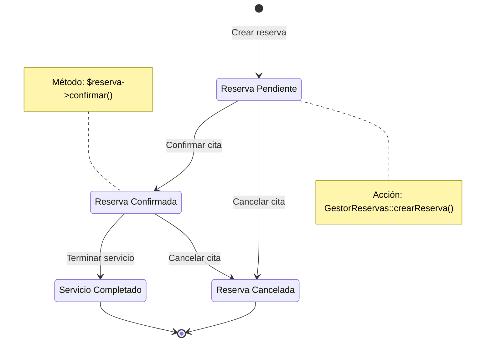
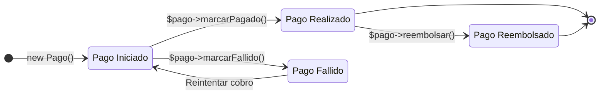
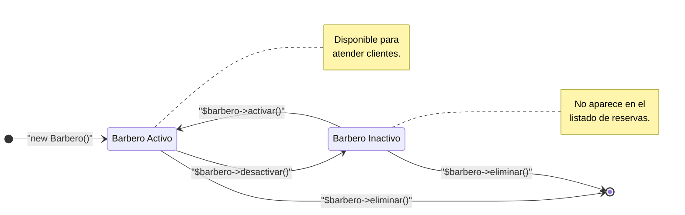
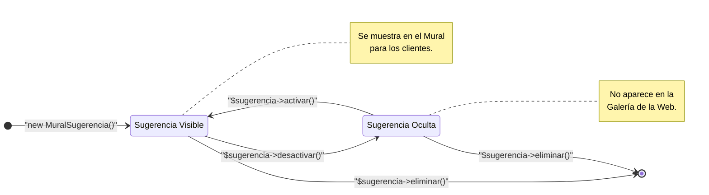

```mermaid
stateDiagram-v2
    direction TB

    state "Reserva Pendiente" as pendiente
    state "Reserva Confirmada" as confirmada
    state "Servicio Completado" as completada
    state "Reserva Cancelada" as cancelada

    [*] --> pendiente : Crear reserva
    
    pendiente --> confirmada : Confirmar cita
    pendiente --> cancelada : Cancelar cita
    
    confirmada --> completada : Terminar servicio
    confirmada --> cancelada : Cancelar cita
    
    completada --> [*]
    cancelada --> [*]

    note right of pendiente
        Acción: GestorReservas::crearReserva()
    end note

    note left of confirmada
        Método: $reserva->confirmar()
    end note
```

```mermaid
stateDiagram-v2
    direction LR

    state "Pago Iniciado" as iniciado
    state "Pago Realizado" as pagado
    state "Pago Fallido" as fallido
    state "Pago Reembolsado" as reembolsado

    [*] --> iniciado : new Pago()
    
    iniciado --> pagado : $pago->marcarPagado()
    iniciado --> fallido : $pago->marcarFallido()
    
    pagado --> reembolsado : $pago->reembolsar()
    fallido --> iniciado : Reintentar cobro
    
    pagado --> [*]
    reembolsado --> [*]
```

```mermaid
stateDiagram-v2
    direction LR

    [*] --> Activo : "new Barbero()"
    
    state "Barbero Activo" as Activo
    state "Barbero Inactivo" as Inactivo

    Activo --> Inactivo : "$barbero->desactivar()"
    note right of Inactivo
        No aparece en el 
        listado de reservas.
    end note

    Inactivo --> Activo : "$barbero->activar()"
    note right of Activo
        Disponible para 
        atender clientes.
    end note

    Activo --> [*] : "$barbero->eliminar()"
    Inactivo --> [*] : "$barbero->eliminar()"
```

```mermaid
stateDiagram-v2
    direction LR

    [*] --> Activa : "new MuralSugerencia()"
    
    state "Sugerencia Visible" as Activa
    state "Sugerencia Oculta" as Inactiva

    Activa --> Inactiva : "$sugerencia->desactivar()"
    note right of Inactiva
        No aparece en la 
        Galería de la Web.
    end note

    Inactiva --> Activa : "$sugerencia->activar()"
    note right of Activa
        Se muestra en el Mural
        para los clientes.
    end note

    Activa --> [*] : "$sugerencia->eliminar()"
    Inactiva --> [*] : "$sugerencia->eliminar()"
```