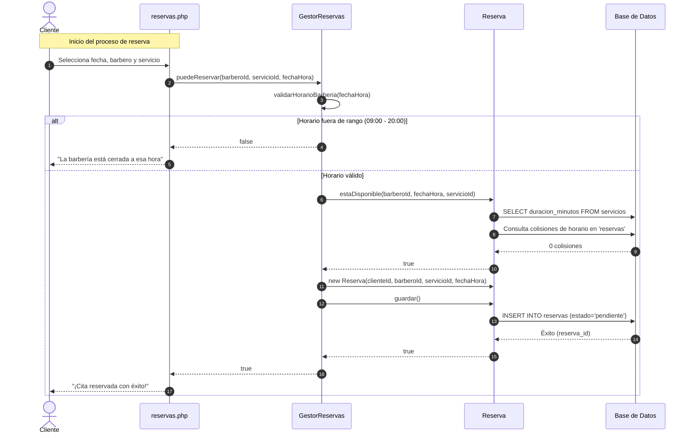
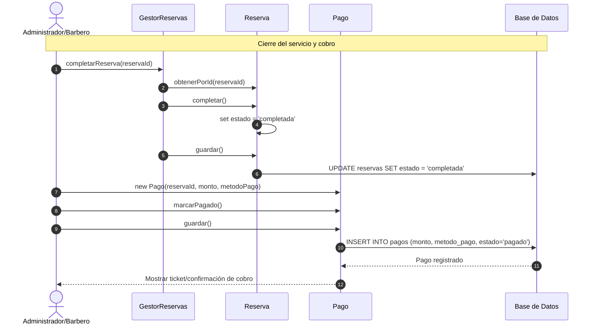

```mermaid
sequenceDiagram
    autonumber
    actor Cliente
    participant Vista as reservas.php
    participant Gestor as GestorReservas
    participant R as Reserva
    participant DB as Base de Datos

    Note over Cliente, Vista: Inicio del proceso de reserva
    Cliente->>Vista: Selecciona fecha, barbero y servicio
    Vista->>Gestor: puedeReservar(barberoId, servicioId, fechaHora)
    
    Gestor->>Gestor: validarHorarioBarberia(fechaHora)
    
    alt Horario fuera de rango (09:00 - 20:00)
        Gestor-->>Vista: false
        Vista-->>Cliente: "La barbería está cerrada a esa hora"
    else Horario válido
        Gestor->>R: estaDisponible(barberoId, fechaHora, servicioId)
        R->>DB: SELECT duracion_minutos FROM servicios
        R->>DB: Consulta colisiones de horario en 'reservas'
        DB-->>R: 0 colisiones
        R-->>Gestor: true
        
        Gestor->>R: new Reserva(clienteId, barberoId, servicioId, fechaHora)
        Gestor->>R: guardar()
        R->>DB: INSERT INTO reservas (estado='pendiente')
        DB-->>R: Éxito (reserva_id)
        
        R-->>Gestor: true
        Gestor-->>Vista: true
        Vista-->>Cliente: "¡Cita reservada con éxito!"
    end
```

```mermaid
sequenceDiagram
    autonumber
    actor Admin as Administrador/Barbero
    participant Gestor as GestorReservas
    participant R as Reserva
    participant P as Pago
    participant DB as Base de Datos

    Note over Admin, DB: Cierre del servicio y cobro
    Admin->>Gestor: completarReserva(reservaId)
    Gestor->>R: obtenerPorId(reservaId)
    Gestor->>R: completar()
    R->>R: set estado = 'completada'
    Gestor->>R: guardar()
    R->>DB: UPDATE reservas SET estado = 'completada'
    
    Admin->>P: new Pago(reservaId, monto, metodoPago)
    Admin->>P: marcarPagado()
    Admin->>P: guardar()
    
    P->>DB: INSERT INTO pagos (monto, metodo_pago, estado='pagado')
    DB-->>P: Pago registrado
    
    P-->>Admin: Mostrar ticket/confirmación de cobro
```